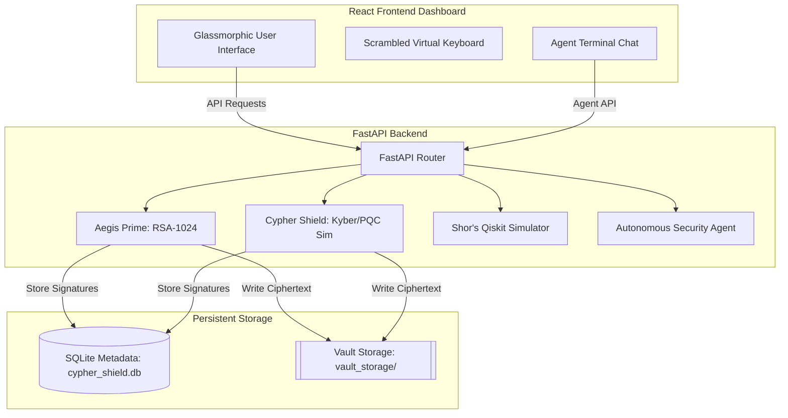

# 🛡️ Cypher Shield
### *Post-Quantum Cryptography (PQC) & Agentic Security Sandbox*

Welcome to **Cypher Shield**, an interactive cybersecurity simulation platform built to demonstrate the practical differences between legacy public-key cryptosystems (Aegis Prime) and Next-Generation Post-Quantum Cryptography (Cypher Shield). 

With a stunning glassmorphic interface, real-time logging, physical vault simulation, and an autonomous AI security auditor chatbot, Cypher Shield provides an immersive experience showcasing why the world must migrate to quantum-resistant standards.

---

## 📸 UI Demo Preview
The interface is structured as a sci-fi tactical cybersecurity command center split into:
1. **Client System Dashboard**: Input data/files, encrypt payloads, manage keys, and execute decryptions using custom scrambled keypads.
2. **Server Vault (Laptop Database)**: Interact with SQLite storage metadata and inspect raw base64 ciphertexts on disk.
3. **Quantum Attacker Panel**: Initialize Shor's and Grover's algorithm attacks and observe real-time qubit state processing outputs.
4. **Agentic Security Auditor**: An autonomous agent to audit compliance, scan vulnerabilities, and exploit weak files.

---

## 🏗️ Architecture Overview

The sandbox operates through a client-server architecture separating encryption logic, database metadata, and physical vault storage.



---

## ⚡ Key Features

### 1. 🗝️ Aegis Prime (Legacy Crypto)
* Represents the traditional public key infrastructure (RSA-1024).
* Performs file signing (using SHA-256 and RSA signatures) and hybrid AES-EAX symmetric file encryption wrapped in RSA-OAEP session envelopes.
* **Quantum Vulnerability**: Vulnerable to prime-factorization attacks under polynomial bounds.

### 2. 🛡️ Cypher Shield (Post-Quantum Cryptography)
* Simulates lattice-based cryptosystems (such as ML-KEM/Kyber-512 and ML-DSA/Dilithium).
* Generates lattice key pairs and encapsulates shared secrets using a secure Lattice Key Encapsulation Mechanism (KEM).
* Demonstrates "mathematical gibberish"—lattices output multi-dimensional coordinates that quantum computers cannot reduce in polynomial time.

### 3. 🌀 Quantum Attacker Simulation
* **Shor's Algorithm Simulation**: Runs a simulated Quantum Phase Estimation (QPE) period-finding circuit using **IBM Qiskit** `StatevectorSampler` to successfully factor RSA moduli, retrieve private keys, and flag target systems as `BREACHED`.
* **Lattice Attack Failure**: Executes short-vector lattice parsing boundary checks using Grover's search simulation, resulting in polynomial bounds exhaustion and keeping the server `ENCRYPTED`.

### 4. 🤖 Agentic AI Security Auditor
* **Audit Compliance**: Evaluates all files in the database, yielding a PQC Readiness Index score based on active security postures.
* **Vulnerability Scan**: Detects weak RSA configurations, outputting audit records with critical warnings.
* **Autonomous Penetration**: Locates legacy files on disk, runs Shor's algorithms to recover keys, and decrypts target payloads automatically.
* **Technical Chatbot**: Explains Shor's complexity, lattice geometry, Kyber KEM parameters, and post-quantum migration schedules in a thought-processing layout.

---

## 📁 Repository Directory Structure

- 📂 [**`client/`**](file:///c:/Users/User/OneDrive/Documents/GitHub/cypher%20shield/client) — React + Vite Frontend App
  - 📂 [**`src/`**](file:///c:/Users/User/OneDrive/Documents/GitHub/cypher%20shield/client/src)
    - 📄 [**`App.jsx`**](file:///c:/Users/User/OneDrive/Documents/GitHub/cypher%20shield/client/src/App.jsx) — Main dashboard views, simulation state machine, digital virtual keyboard, sound synthesis, and agent chatbot.
    - 📄 [**`index.css`**](file:///c:/Users/User/OneDrive/Documents/GitHub/cypher%20shield/client/src/index.css) — Sci-fi typography, CSS grid layouts, glowing animations, and glassmorphic utility rules.
    - 📄 [**`main.jsx`**](file:///c:/Users/User/OneDrive/Documents/GitHub/cypher%20shield/client/src/main.jsx) — React application mount file.
  - 📄 [**`package.json`**](file:///c:/Users/User/OneDrive/Documents/GitHub/cypher%20shield/client/package.json) — Frontend dependency manifest.
- 📂 [**`server/`**](file:///c:/Users/User/OneDrive/Documents/GitHub/cypher%20shield/server) — Python FastAPI Backend App
  - 📄 [**`main.py`**](file:///c:/Users/User/OneDrive/Documents/GitHub/cypher%20shield/server/main.py) — FastAPI routing handlers for encryption, decryption, attacks, and agent operations.
  - 📄 [**`crypto_utils.py`**](file:///c:/Users/User/OneDrive/Documents/GitHub/cypher%20shield/server/crypto_utils.py) — Core cryptography algorithms (RSA, Qiskit circuits, Kyber/Dilithium simulations, and agent workflows).
  - 📄 [**`database.py`**](file:///c:/Users/User/OneDrive/Documents/GitHub/cypher%20shield/server/database.py) — SQLite integration managing database initializations, listings, and metadata record saves.
  - 📂 [**`vault_storage/`**](file:///c:/Users/User/OneDrive/Documents/GitHub/cypher%20shield/server/vault_storage) — Physical storage vault directory containing raw encrypted `.aegis` and `.cypher` files.

---

## 🚀 Setup & Installation

### Prerequisites
* **Node.js** (v18.0.0 or higher)
* **Python** (v3.10.0 or higher)

---

### Backend Setup
1. Navigate to the server folder:
   ```bash
   cd server
   ```
2. Create and activate a Python virtual environment:
   ```bash
   python -m venv venv
   # On Windows:
   .\venv\Scripts\activate
   # On macOS/Linux:
   source venv/bin/activate
   ```
3. Install the required dependencies:
   ```bash
   pip install fastapi uvicorn pycryptodome qiskit python-multipart pydantic
   ```
4. Run the FastAPI server:
   ```bash
   python main.py
   ```
   *The API server will run at **http://localhost:8000**.*

---

### Frontend Setup
1. Open a new terminal and navigate to the client folder:
   ```bash
   cd client
   ```
2. Install npm dependencies:
   ```bash
   npm install
   ```
3. Start the Vite development server:
   ```bash
   npm run dev
   ```
   *The frontend dashboard will run at **http://localhost:5173** (or alternative port listed in console).*

---

## 🧪 Simulation Walkthrough & Demo Guide

### Scenario A: Aegis Prime Key Breach (Classic RSA)
1. In the **Client System** panel, choose **Aegis Prime (RSA)** mode.
2. Select **Text Input** or upload a sample file.
3. Toggle the **Digital Keyboard** to enter credentials securely, and click **Secure Upload to Server**.
4. Check the **Server Vault** panel to see the record created with its public keys, RSA signatures, and a binary payload path.
5. In the **Quantum Attacker** panel, click **Initialize Quantum Attack**.
6. Observe the log stream executing Shor's period-finding algorithm via Qiskit.
7. Once factored, the Attacker panel displays the recovered private key, and the Vault status indicator switches to **BREACHED 🛑**.

### Scenario B: Cypher Shield Lattice Resilience (Post-Quantum)
1. Select **Cypher-Shield (PQC)** mode in the **Client System** panel.
2. Upload data and click **Secure Upload to Server**.
3. Verify the server vault metadata, which now points to a PQC Kyber KEM configuration.
4. Click **Initialize Quantum Attack** on the **Quantum Attacker** panel.
5. Watch the log output attempt Grover's Search and Lattice Coordinate reduction.
6. The process exits with a bounds exhaustion error, showing the vault status remaining **SECURE 🛡️**.

### Scenario C: Agentic AI Security Assessment
1. Switch the application navigation tab from **Dashboard** to **Agentic Terminal**.
2. Click **Scan Vulnerabilities** to let the agent catalog vulnerable RSA databases.
3. Click **Autonomous Exploit** to witness the agent locate legacied entries, invoke period finding algorithms, and decrypt file strings.
4. Run **Compliance Audit** to output a full security scorecard.
5. Ask the chatbot questions such as: *"Why is lattice cryptography resistant to Shor's algorithm?"* to read its structured markdown explanations.

---

## 🔒 Security Disclaimer
This application is designed solely for **educational, testing, and simulation purposes**. Qiskit calculations run over truncated qubit dimensions representing small integer equivalencies to illustrate the phase estimation process, and PQC components simulate KEM properties to operate natively without compilation dependencies.
